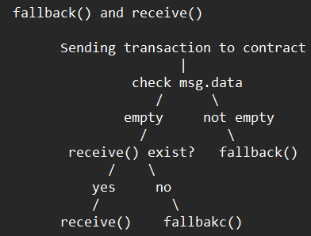

# **Shooting 101**

## **Description** 
```
Your metallic body might have advanced targeting systems, but hitting a target is not just about technical proficiency. 
To truly master the art of targeting, you must learn to trust your instincts and develop a keen sense of intuition. 
During this training, you will emerge as a skilled marksman who can hit the targets with deadly precision. 
It's about time to train and prove yourself in the Shooting Area, can you make it?
```

You can download the files [here](./downloadable/blockchain_shooting_101.zip)

**Setup.sol**
```solidity
pragma solidity ^0.8.18;

import {ShootingArea} from "./ShootingArea.sol";

contract Setup {
    ShootingArea public immutable TARGET;

    constructor() {
        TARGET = new ShootingArea();
    }

    function isSolved() public view returns (bool) {
        return TARGET.firstShot() && TARGET.secondShot() && TARGET.thirdShot();
    }
}
```

**ShootingArea.sol**
```solidity
pragma solidity ^0.8.18;

contract ShootingArea {
    bool public firstShot;
    bool public secondShot;
    bool public thirdShot;

    modifier firstTarget() {
        require(!firstShot && !secondShot && !thirdShot);
        _;
    }

    modifier secondTarget() {
        require(firstShot && !secondShot && !thirdShot);
        _;
    }

    modifier thirdTarget() {
        require(firstShot && secondShot && !thirdShot);
        _;
    }

    receive() external payable secondTarget {
        secondShot = true;
    }

    fallback() external payable firstTarget {
        firstShot = true;
    }

    function third() public thirdTarget {
        thirdShot = true;
    }
}
```

## **Approach**

Addresses for this challenge:
```
Private key     :  0xf64792a746f00890a419e6d69525dab7b95fb5fc4889625d01fa7917e1a0447f
Address         :  0x140B211270009e1571eFfaF0409b1412D081f366
Target contract :  0xfb7ACc4e787dcd2a53b5AcCF91cB868839E34cBF
Setup contract  :  0x4c787E4ea28dB47Cd65d1e4702cEafcE0613d6Fc
```

This challeenge has 3 modifier, a fallback, a receive and a function. Well let me explain a little bit about the types.

- **Modifier** is a special function that actively check if its conditions are fulfilled, but we also can't call them since they will check for their condition satisfaction frequently. ( You'll find this function **ALWAYS** with **require()**)

- **function** is just a normal function...

as for receive and fallback, maybe the image below can explain it better.

<p align="center">
    
</p>

So how exactly we can solve this challenge?

We need to call receive(), fallback(), and third() in the right order to satisfy the modfier. The **firstTarget** is complete right away when we call the contract, now to **secondTarget** can be complete once firstShot is true and the **thirdTarget** will be complete if we shot all 3 targets.

So the order must be like this:
```
Fallback() -> Receive() -> third() -> isSolved()
```

Based on the picture above about receive and fallback, we can call fallback by sending some values in the message data, so we did this first.

```python
signed_fallback = web3.eth.account.sign_transaction({
    'from': wallet_address,
    'to': contract_address,
    'gasPrice':web3.to_wei('4','gwei'),
    'gas':100000, 
    'nonce':nonce,
    'data': b'0x12345'
    }, wallet_privatekey)
fallbacksend = web3.eth.send_raw_transaction(signed_fallback.rawTransaction)
fallbackid = fallbacksend.hex()
```

proceed to calling the receive now using this:

```python
signed_recv = web3.eth.account.sign_transaction({
    'from': wallet_address,
    'to': contract_address,
    'gasPrice':web3.to_wei('4','gwei'),
    'gas':100000, 
    'nonce':nonce,
    'data': b'0x0'
    }, wallet_privatekey)
recvsend = web3.eth.send_raw_transaction(signed_recv.rawTransaction)
recvid = recvsend.hex()
```

after we do that it's time to call shot the last bullet, call the THIRD!

```python
transaction = contract.functions.third().build_transaction(tx)
signed_tx = web3.eth.account.sign_transaction(transaction, wallet_privatekey)
tx_hash = web3.eth.send_raw_transaction(signed_tx.rawTransaction)
transaction_hash = web3.to_hex(tx_hash)
tx_receipt = web3.eth.wait_for_transaction_receipt(tx_hash)
print(tx_receipt)
```

well it's done, the conditions must be satisfied now, let's call **isSolved()**

```python
from web3 import Web3
from web3.middleware import geth_poa_middleware
import requests

rpc_url = "http://165.232.108.36:31136"

contract_address = "0xfb7ACc4e787dcd2a53b5AcCF91cB868839E34cBF"

abi = '[{"inputs": [],"stateMutability": "nonpayable","type": "constructor"},{"inputs": [],"name": "TARGET","outputs": [{"internalType": "contract Unknown","name": "","type": "address"}],"stateMutability": "view","type": "function"},{"inputs": [],"name": "isSolved","outputs": [{"internalType": "bool","name": "","type": "bool"}],"stateMutability": "view","type": "function"}]'

wallet_address = "0x140B211270009e1571eFfaF0409b1412D081f366"
wallet_privatekey = "0xf64792a746f00890a419e6d69525dab7b95fb5fc4889625d01fa7917e1a0447f"
web3 = Web3(Web3.HTTPProvider(rpc_url))
web3.middleware_onion.inject(geth_poa_middleware, layer=0)

contract = web3.eth.contract(address=contract_address,abi=abi)

nonce = web3.eth.get_transaction_count(wallet_address)

tx = {
    'nonce' : nonce,
    'gas' : 100000,
    'gasPrice' : web3.to_wei('4','gwei'),
    'from': wallet_address
}

signed_fallback = web3.eth.account.sign_transaction({
    'from': wallet_address,
    'to': contract_address,
    'gasPrice':web3.to_wei('4','gwei'),
    'gas':100000, 
    'nonce':nonce,
    'data': b'0x12345'
    }, wallet_privatekey)
fallbacksend = web3.eth.send_raw_transaction(signed_fallback.rawTransaction)
fallbackid = fallbacksend.hex()

signed_recv = web3.eth.account.sign_transaction({
    'from': wallet_address,
    'to': contract_address,
    'gasPrice':web3.to_wei('4','gwei'),
    'gas':100000, 
    'nonce':nonce,
    'data': b'0x0'
    }, wallet_privatekey)
recvsend = web3.eth.send_raw_transaction(signed_recv.rawTransaction)
recvid = recvsend.hex()

transaction = contract.functions.third().build_transaction(tx)
signed_tx = web3.eth.account.sign_transaction(transaction, wallet_privatekey)
tx_hash = web3.eth.send_raw_transaction(signed_tx.rawTransaction)
transaction_hash = web3.to_hex(tx_hash)
tx_receipt = web3.eth.wait_for_transaction_receipt(tx_hash)
print(tx_receipt)

transaction = contract.functions.isSolved().build_transaction(tx)
signed_tx = web3.eth.account.sign_transaction(transaction, wallet_privatekey)
tx_hash = web3.eth.send_raw_transaction(signed_tx.rawTransaction)
transaction_hash = web3.to_hex(tx_hash)
tx_receipt = web3.eth.wait_for_transaction_receipt(tx_hash)
print(tx_receipt)
```

## **Flag**

```HTB{f33l5_n1c3_h1771n6_y0ur_74r6375}```